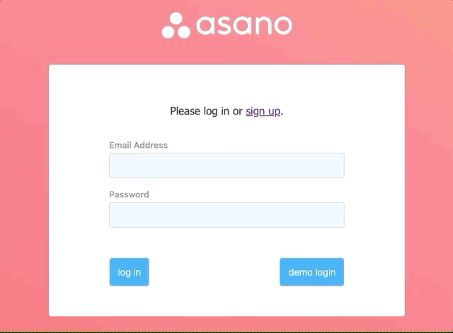
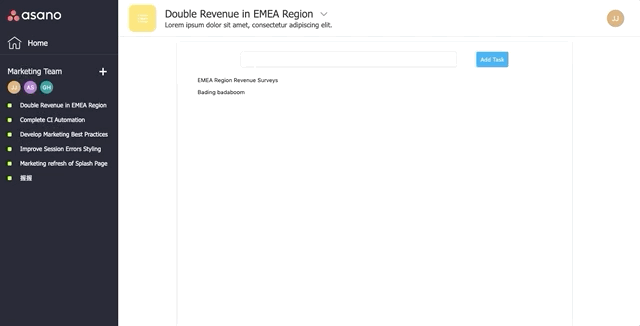

# Asano

[Live Demo](http://asano.herokuapp.com)

Asano is an agile project management tool inspired by Asana, built to organize all aspects of your personal and professional lives. 

The bulk of this project was designed and built within a 10-day timeframe, though new features and improvements are planned to be implemented over time.

It makes use of a Rails/PostgreSQL backend with React.js and Redux on the frontend.

## Features
* Secure frontend to backend user authentication using BCrypt
* Users can create and update tasks through a modal partial
* Users can edit and delete tasks through dropdown menus
* Users can create, read, and update tasks
* Project page dynamically updates with task details when a task is selected

#### Mimicking User Login for Demo user



As part of my user authentication MVP, I implemented a demo user-login that would bypass the need for any visitors to sign-up for an account. One of the most personally challenging and interesting pieces of this was being able to simulate a (demo) user login as if someone was actually typing on the keyboard for the user.

```
    handleDemoSubmit(e) {
        e.preventDefault();

        let demoEmail = 'jinfull2@gmail.com'.split('');
        let demoPass = 'jinfull'.split('');

        this.setState({
            email: this.state.email,
            password: this.state.password,
        }, () => this.demoLogin(demoEmail, demoPass));

        setTimeout(() => { this.handleSubmit(e); }, 2500);
    }

    demoLogin(email, password) {
        if (email.length > 0) {
            this.setState({ email: this.state.email += email.shift() },
                () => window.setTimeout(() => this.demoLogin(email, password), 60));
        } else if (password.length > 0) {
            this.setState({ password: this.state.password += password.shift() },
                () => window.setTimeout(() => this.demoLogin(email, password), 70));
        } else if (email.length === 0 && password.length === 0) {
            this.demoLogin(this.state.email, this.state.password);
        }
    }
```

When the user triggers this action, the initial state is set to be empty with a callback to the demoLogin function. The demoLogin function recursively calls itself, shifting one character off at a time and re-setting the local state each time with the additional character. 

Once there are no more characters remaining in both the demoEmail and demoPass, a "normal" login will be processed with the full demo credentials from the updated state.

#### Partials and Conditional Rendering



Partials and conditional rendering are both used throughout my code in order to keep code as DRY as possible. Whenever possible, similar components were combined into singular, reusable components to avoid having the same repeated code in different places.

```
        let nameInputs = null;
        let demoLoginButton = null;

        if (this.props.formType === 'sign up') {
            nameInputs = 
                <div className="name-inputs-label">
                    <label className="session-label">First Name
                        <input
                            type='text'
                            value={this.state.first_name}
                            onChange={this.update('first_name')}
                            className="session-input"
                            id="session-input"
                        />
                    </label>

                    <label className="session-label">Last Name
                        <input
                            type='text'
                            value={this.state.last_name}
                            onChange={this.update('last_name')}
                            className="session-input"
                            id="session-input"
                        />
                    </label>
                </div>
        } else {
            demoLoginButton = 
                <button className='session-submit' id='demo-login' onClick={(e) => this.handleDemoSubmit(e)}>
                    demo login
                </button>
        }
```

Above, we assign two components based on our props without the need to repeat code. We then render both and depending on the session form type, only one of these components will be rendered.


## Technologies

Rails was chosen due to its out-of-the-box support for relational databases and its RESTful architecture. Heroku dynos enabled better usability with an easier development experience and PostgreSQL as an available open source DBMS.

As this project is meant to be a smaller-scale portfolio piece being built in a relatively short timeframe, convenience and speed were prioritized over scalability.

As a result, the technologies used for this project (Heroku, Rails, PostgreSQL) were chosen to be used as they were determined to be adequate for the predicted load and scope of this project. 

## Additional Resources

* [Database Schema](https://github.com/jinfull/asano/wiki/Schema)
* [Sample State](https://github.com/jinfull/asano/wiki/Sample-State)
* API Endpoints
    * [Frontend Routes](https://github.com/jinfull/asano/wiki/Frontend-Routes)
    * [Backend Routes](https://github.com/jinfull/asano/wiki/Backend-Routes)

## Potential Future Releases

In the future I would like to add: 

* Ability to comment on Tasks
* Calendar feature to view important project dates
* Project board view 